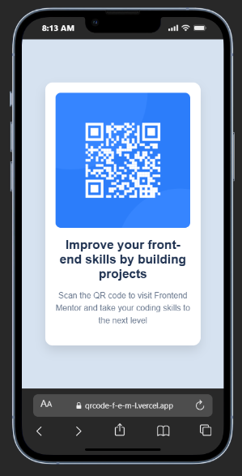
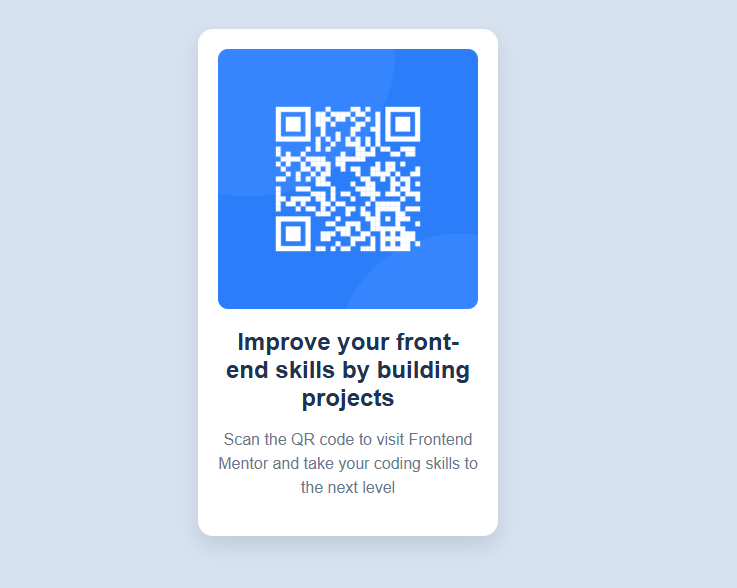

# QR Code Component using HTML and CSS

This is a solution to the [QR code component challenge on Frontend Mentor](https://www.frontendmentor.io/challenges/qr-code-component-iux_sIO_H). Frontend Mentor challenges help you improve your coding skills by building realistic projects. 

## Table of contents

- [Overview](#overview)
  - [Screenshots](#screenshots)
  - [Links](#links)
- [My process](#my-process)
  - [Built with](#built-with)
  - [What I learned](#what-i-learned)
  - [Continued development](#continued-development)
  - [Useful resources](#useful-resources)
- [Author](#author)
- [Acknowledgments](#acknowledgments)

## Overview

A clean, responsive QR code preview card built with HTML and CSS. It centers a QR image and descriptive text inside a white card with rounded corners and a soft shadow. The goal was to match the Frontend Mentor design and ensure great readability across mobile and desktop.

Key objectives:
- Match design spacing, typography, and colors
- Center the card vertically and horizontally on the viewport
- Optimize for mobile-first, then scale up for larger screens

### Screenshots

**Mobile View**


**Web View**


### Links

- Live Site URL: [https://qrcode-f-e-m-l.vercel.app](https://qrcode-f-e-m-l.vercel.app)

## My process

This section outlines the steps I followed to build and refine the component.

- Planning: Reviewed the design, noted the core layout, colors, and type scale.
- Structure: Wrote semantic HTML (`main`, headings, and an `img` with meaningful `alt`).
- Styling: Implemented card styles (padding, border-radius, shadow) and consistent typography.
- Responsive: Mobile-first styles; added media queries to scale the card width on larger screens.
- Accessibility: Clear `alt` text, readable contrast, logical heading order for screen readers.
- Deployment: Hosted the site on Vercel at the live URL provided.

### Built with

- Semantic HTML5 markup
- CSS3
- Flexbox
- Mobile-first workflow

### What I learned

- Centering content reliably with Flexbox
- Applying a mobile-first approach with media queries
- Structuring semantic HTML for accessibility
- Keeping CSS consistent with spacing, sizing, and colors

Code example – Flexbox center:

```css
body {
  display: flex;
  justify-content: center;
  align-items: center;
  min-height: 100vh;
  background-color: hsl(212, 45%, 89%);
  font-family: 'Outfit', sans-serif;
}
```

Responsive container:

```css
.container {
  width: 90%;
  max-width: 320px;
  padding: 16px;
  border-radius: 10px;
  background-color: #fff;
  box-shadow: 0 25px 50px rgba(0, 0, 0, 0.1);
}

@media (min-width: 640px) {
  .container { max-width: 380px; }
}
```

### Continued development

- Enhance accessibility (ARIA, focus states, contrast)
- Explore CSS Grid for multi-component layouts
- Add subtle transitions/animations
- Optimize assets and refine performance

### Useful resources

- [Frontend Mentor](https://www.frontendmentor.io/) – Great challenges and community
- [MDN Web Docs – Flexbox](https://developer.mozilla.org/en-US/docs/Learn/CSS/CSS_layout/Flexbox)
- [MDN Web Docs – Responsive Design](https://developer.mozilla.org/en-US/docs/Learn/CSS/CSS_layout/Responsive_Design)
- [CSS-Tricks – Complete Guide to Flexbox](https://css-tricks.com/snippets/css/a-guide-to-flexbox/)
- [Web.dev – Responsive Basics](https://web.dev/responsive-web-design-basics/)

## Author

- Name: Abdullahi Usman
- Website: [Portfolio Website](https://abdullahiusman.tech)
- GitHub: [Add your GitHub profile URL]

## Acknowledgments

Thanks to Frontend Mentor for the challenge and assets.
